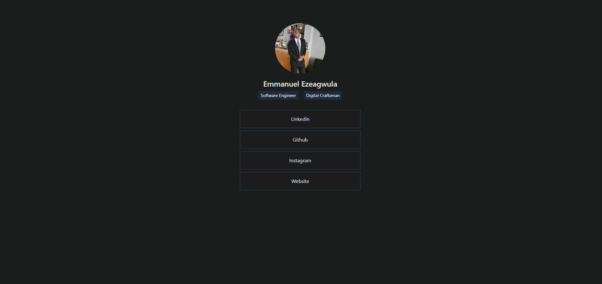

<p align="center">
<a href=https://github.com/Goldennboyy/Emmanuel-bio target="_blank">

</a>
</p>

<p align="center">


</p>

## 🔍 Table of Contents

- [💻 Stack](#stack)

- [📝 Project Summary](#project-summary)

- [⚙️ Setting Up](#setting-up)

- [🚀 Run Locally](#run-locally)

- [🙌 Contributors](#contributors)

## 💻 Stack

- [react](https://reactjs.org/): JavaScript library for building user interfaces.
- [react-dom](https://reactjs.org/docs/react-dom.html): Provides DOM-specific methods for React.
- [typescript](https://www.typescriptlang.org/): Adds static typing to JavaScript.
- [eslint](https://eslint.org/): Pluggable JavaScript linter.
- [tailwindcss](https://tailwindcss.com/): Utility-first CSS framework for rapid UI development.
- [postcss](https://postcss.org/): Tool for transforming CSS with JavaScript plugins.
- [vite](https://vitejs.dev/): Next-generation front-end build tool.
- [autoprefixer](https://autoprefixer.github.io/): PostCSS plugin to parse CSS and add vendor prefixes.

## 📝 Project Summary

- [**src**](src): Contains the main source code of the TypeScript project.
- [**src/components**](src/components): Houses the reusable components of the application.
- [**src/interface**](src/interface): Defines interfaces used throughout the project.
- [**src/assets**](src/assets): Stores various assets used in the application.
- [**src/assets/pictures**](src/assets/pictures): Contains pictures used within the application.
- [**public**](public): Holds static files that will be served by the web server.

## ⚙️ Setting Up

## 🚀 Run Locally

1.Clone the Emmanuel-bio repository:

```sh
git clone https://github.com/Goldennboyy/Emmanuel-bio
```

2.Install the dependencies with one of the package managers listed below:

```bash
pnpm install
bun install
npm install
yarn install
```

3.Start the development mode:

```bash
pnpm dev
bun dev
npm run dev
yarn dev
```
